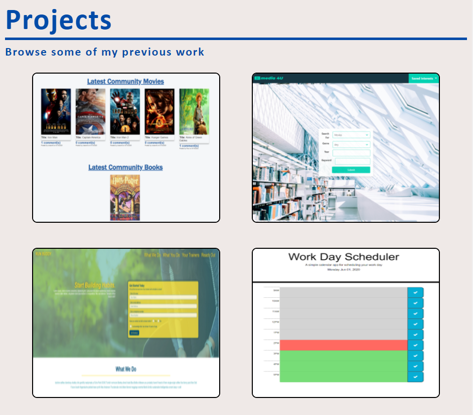
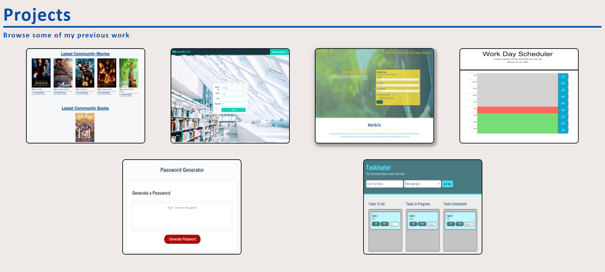
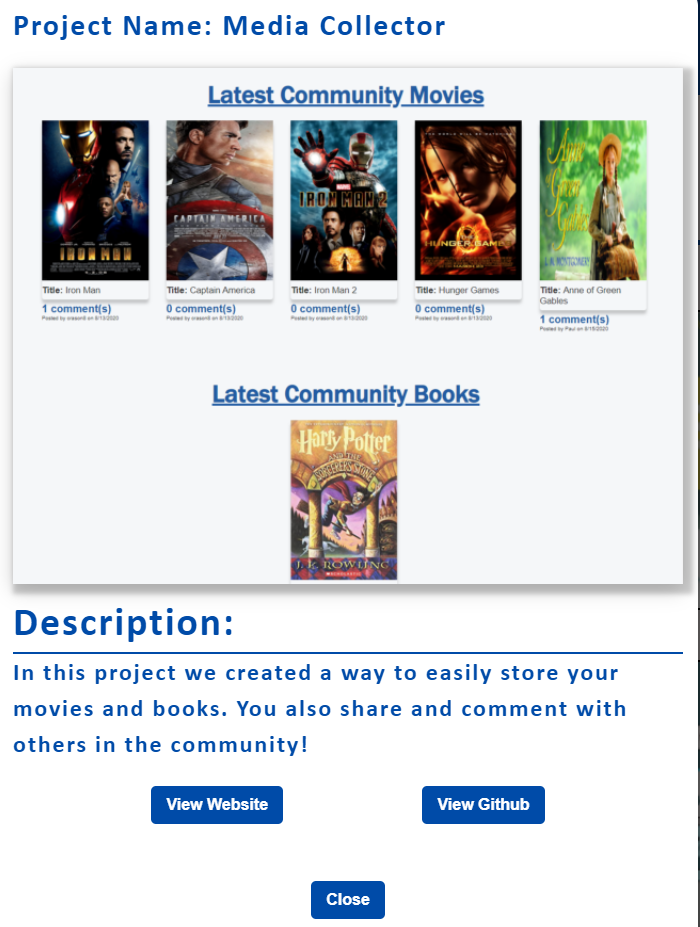
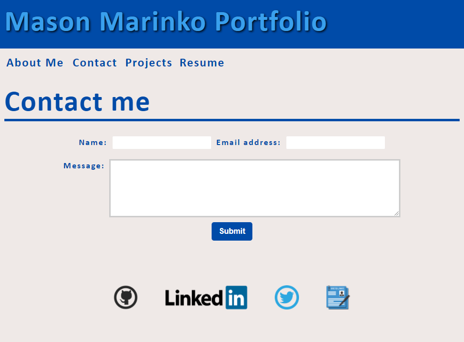
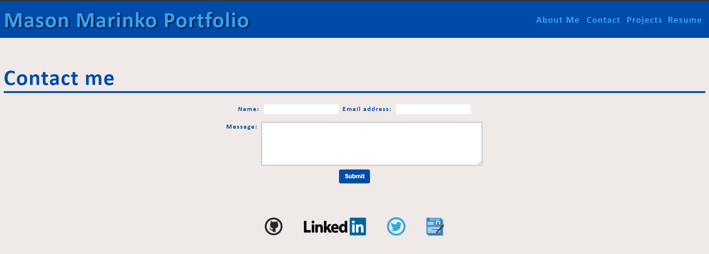

# Mason Marinko Portfolio 

## Links

Repository Link: [Mason Marinko Portfolio](https://github.com/MasonMarinko/portfolio-masonmarinko/)

Live URL Link: [Mason Marinko Portfolio Website](https://masonmarinko.github.io/portfolio-masonmarinko/)

## Description

- 

## Table of Contents
* [Usage](#usage)
* [License](#license)
* [Questions](#questions)

## Usage/Features

1) You are first greeted with an easy to use and straight forward header. The header will adjust based on screen size with the icons moving below the navigation bar when mobile/smaller size. Another thing that changes is the effect when scrolling over the buttons, when full screen they will do a different effect than when the screen is smaller.

2) If you select the "About Me" section you will be toggled to the bottom of the page. The about me section is always present but stays at the bottom of the page, that way anyone looking through my projects will see me at the end. I've also included screenshots showing the difference in style when in mobile or larger screen in browser. Another thing you might notice is the footer which has clickable icons for my Github, Linkedin, Twitter and Resume.

3) The homepage (or if user selects project option in the navigation bar) shows the member cards of projects i've worked on. Once a card is selected the user is met with a modal (shown in next description/picture). Although words will be added to the cards in the meantime I found the cards more appealing to click on without. The user is forced to be curious from the images and only find the information and links if they select the item.

4) The modal tells the user about the specific project, they are shown the title, a description, and 3 buttons. A button for the live website, a button for the repo and a button to close the modal and return to the project menu. 

5) If the user select the "Contact" option they will be met with these screens (One shows website in mobile view, other in full screen). The user can type there name, email address as well as a message, you'll also notice the footer is present as well with all of my personal links.

6) If the user selects the "Resume" option at the top of the page in the nav bar, or by selecting the option in the footer they are then taken to my Resume on Google Docs, this will make it much easier to update the resume instead of constantly uploading a new resume with each update.

## License
This project is covered under the following license(s):
ISC

## Questions? Ask Us:

GitHub Profiles:

- [Mason Marinko](https://github.com/masonmarinko)

Questions? Contact Us:
- [Mason Marinko](<Mason.P.Marinko@gmail.com>)
