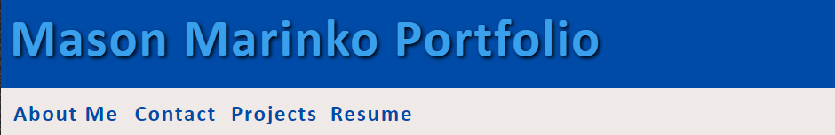

# Mason Marinko Portfolio 

## Links

Repository Link: [Mason Marinko Portfolio](https://github.com/MasonMarinko/portfolio-masonmarinko/)

Live URL Link: [Media Collector Website](https://masonmarinko.github.io/portfolio-masonmarinko/)

## Description
- 

## Table of Contents
* [Usage](#usage)
* [License](#license)
* [Questions](#questions)

## Usage/Features

1) You are first greeted with an easy to use and straight forward header. The header will adjust based on screen size with the icons moving below the navigation bar when mobile/smaller size. Another thing that changes is the effect when scrolling over the buttons, when full screen they will do a different effect than when the screen is smaller.

2) If you select the "About Me" section you will be toggled to the bottom of the page. The about me section is always present but stays at the bottom of the page, that way anyone looking through my projects will see me at the end. I've also included screenshots showing the difference in style when in mobile or larger screen in browser. Another thing you might notice is the footer which has clickable icons for my Github, Linkedin, Twitter and Resume.

3) 

4) 

5) 

6) 

## License
This project is covered under the following license(s):
ISC

## Questions? Ask Us:

GitHub Profiles:

- [Mason Marinko](https://github.com/masonmarinko)

Questions? Contact Us:
- [Mason Marinko](<Mason.P.Marinko@gmail.com>)
